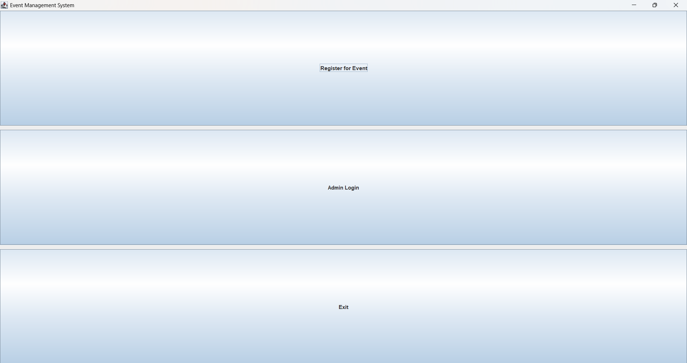
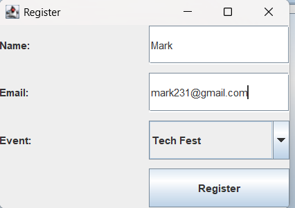
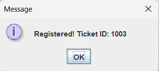
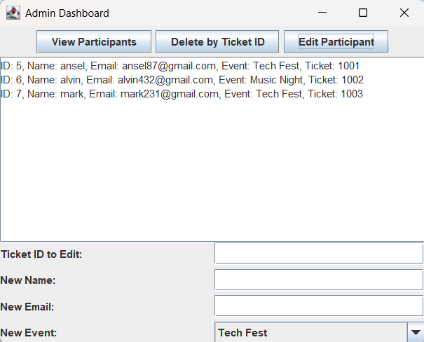
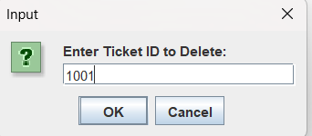
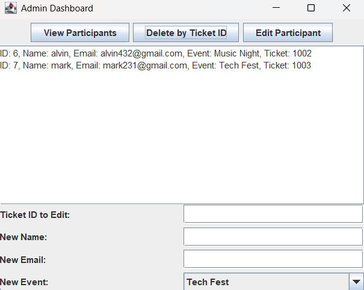

# Event Management System

## Team Members
- Alvin Mathew
- Ansel Biju Joseph

## Problem Statement
This project implements a simple Event Management System that allows users to register for events and enables administrators to manage participant records.

## Objective
To demonstrate the use of Object-Oriented Programming principles, GUI development using Java Swing, exception handling, multithreading, and database connectivity using JDBC.

## Features
- User Registration (Name, Email, Event selection)
- Automatic Ticket ID Generation
- Admin Dashboard (View, Edit, Delete participants)
- SQLite database integration using JDBC
- Exception handling and input validation
- GUI built using Java Swing

## Technologies Used
- Java
- Java Swing
- JDBC
- SQLite
- NetBeans IDE

## How to Run
1. Clone the repository.
2. Open the project in NetBeans.
3. Ensure SQLite JDBC JAR is added to Libraries.
4. Run EventSystem.java.

## Screenshots

### Home Screen

### Registration Panel

### Registration Confirmation

### Admin Dashboard

### Deleting Participant

### Deleted Confirmation

---

## Sample Test Case

**Input:**
- Name: John
- Email: john213@gmail.com
- Event: Tech Fest

**Output:**
- Ticket ID generated successfully.
- Participant visible in Admin Dashboard.

---

